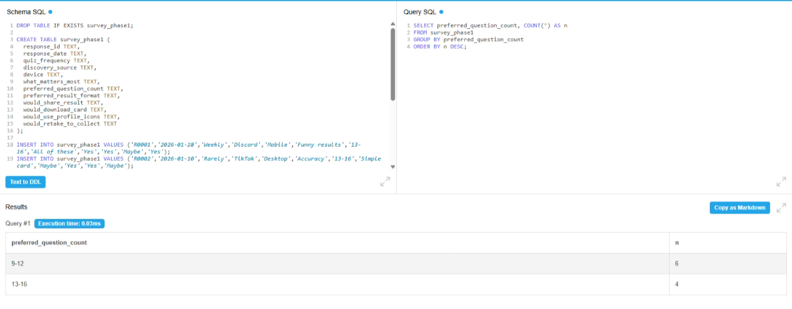
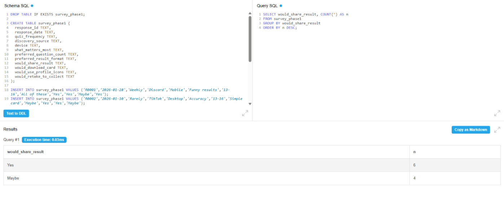

# Phase 1 Findings Summary (Synthetic)

This phase uses a **synthetic multiple-choice survey dataset** to prototype early product analytics for **DessertType (Yumme.club)**.

Note: Phase 1 data is synthetic and is not presented as real user research.

---

## Analysis Setup

The synthetic dataset was imported into SQLite and queried using DB-Fiddle to explore early product signals, including device behavior, quiz length preferences, and sharing intent.

---

## Key Insight 1: Mobile-first usage

Most respondents reported taking personality quizzes on **mobile (6/10)** compared to desktop (4/10).

**Product decision:** DessertType should prioritize a mobile-first experience with thumb-friendly navigation, fast loading, and result cards optimized for small screens.

---

## Key Insight 2: Ideal quiz length for the MVP

The most preferred quiz length was **9–12 questions (6/10)**, followed by **13–16 questions (4/10)**.

**Product decision:** Keep the MVP quiz around **12 questions** to balance engagement with low friction and reduce drop-off.

---

## Key Insight 3: Strong sharing intent

Most respondents indicated they would share their result (**Yes = 6/10**, Maybe = 4/10).

**Product decision:** Sharing should be a primary action on the results page, supported by downloadable cards and one-click social share buttons.

---

## Phase 1 MVP Recommendations

Based on the synthetic analysis, the MVP should focus on:

- A mobile-first quiz flow
- A short quiz length (9–12 questions)
- Collectible, highly shareable result cards
- Clear download + share CTAs on the results screen

---

## Next Steps

- **Phase 2:** Replace synthetic survey data with real user survey exports
- **Phase 3:** Track post-launch engagement events such as:
  - quiz_start
  - quiz_complete
  - share_click
  - download_click
  - retake_click

